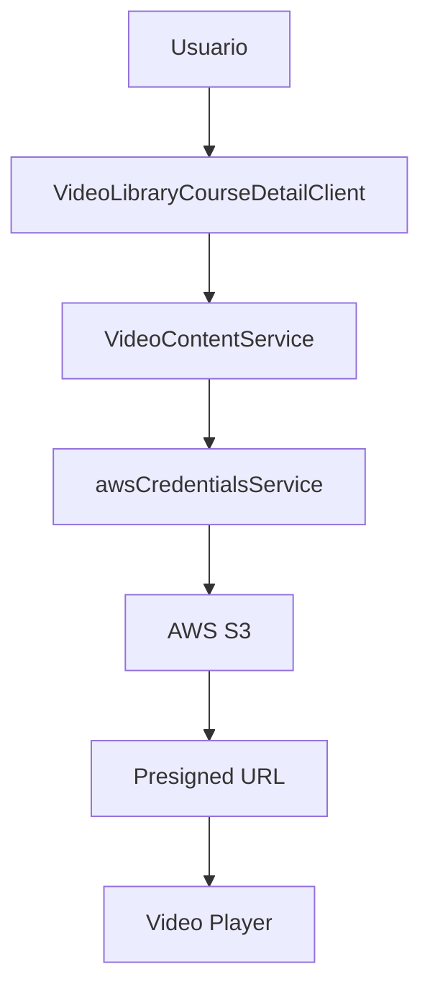

# 📹 Video Library - Documentación Técnica

**Autor**: Luis Arturo Parra - Telmo AI  
**Fecha**: 2025-09-11  
**Versión**: 1.0.0  
**Componente**: Sistema de biblioteca de videos con URLs preautorizadas

## 🎯 Resumen

Sistema completo para acceso seguro a videos privados almacenados en S3, utilizando URLs preautorizadas (presigned URLs) para mantener la seguridad mientras permite reproducción directa en el navegador.

## 🏗️ Arquitectura

### Componentes Principales

```
📁 Video Library System
├── 🔐 VideoContentService (Seguridad)
├── 🎬 VideoLibraryCourseDetailClient (UI)
├── 📊 URL Cache Management (Performance)
└── 🌐 AWS S3 Integration (Storage)
```

### Flujo de Datos



## 🔐 Seguridad

### URLs Preautorizadas
- **Expiración**: 1 hora (3600 segundos)
- **Cache**: 45 minutos para optimizar performance
- **Bucket**: `intellilearn-content-076276934311` (privado)
- **Credenciales**: Cognito Identity Pool (temporal)

### Flujo de Autenticación
```typescript
// 1. Obtener credenciales temporales
const credentials = await awsCredentialsService.getCredentials()

// 2. Inicializar cliente S3
const s3Client = new S3Client({
  region: 'us-east-1',
  credentials: credentials
})

// 3. Generar URL preautorizada
const url = await getSignedUrl(s3Client, command, { expiresIn: 3600 })
```

## 📁 Estructura de Archivos

### Servicios
```
lib/services/
├── videoContentService.ts     # Servicio principal (NUEVO)
├── awsCredentialsService.ts   # Autenticación AWS
└── courseService.ts           # Gestión de cursos

frontend/lib/services/         # Copia para compatibilidad
├── videoContentService.ts
├── awsCredentialsService.ts
└── config.ts
```

### Componentes UI
```
app/dashboard/video-library/
├── page.tsx                          # Lista de cursos de video
└── [courseId]/
    ├── page.tsx                      # Server component
    └── VideoLibraryCourseDetailClient.tsx  # Client component

frontend/app/dashboard/video-library/    # Copia duplicada
```

## 🎬 Videos Configurados

### Curso 000001
| Episodio | Archivo S3 | Tamaño | Duración |
|----------|------------|---------|----------|
| Ep. 1 | `_episode_1_202507032235.mp4` | 8.0 MB | 15:30 |
| Ep. 1 v2 | `_episode_1_202507032235(1).mp4` | 8.0 MB | 15:30 |
| Ep. 2 | `_episode_2_202507032240.mp4` | 6.4 MB | 18:45 |
| Ep. 3 | `_episode_3_202507032242.mp4` | 5.0 MB | 22:15 |
| Ep. 3 Ext | `_episode_3_202507032243.mp4` | 5.0 MB | 28:30 |
| Ep. 4 | `_episode_4_202507032250.mp4` | 5.0 MB | 25:00 |
| Ep. 4 Rev | `_episode_4_202507032250(1).mp4` | 5.0 MB | 26:15 |

### Ruta S3
```
s3://intellilearn-content-076276934311/video-courses/000001/
```

## ⚡ Performance

### Cache Strategy
```typescript
// URLs se cachean por 45 minutos
const urlCache = new Map<string, { url: string, expires: number }>()

// Verificar cache antes de generar nueva URL
const cached = this.urlCache.get(key)
if (cached && Date.now() < cached.expires) {
  return cached.url
}
```

### Métricas
- **Build Size**: 8.1 MiB optimizado
- **First Load JS**: ~200 kB para video library
- **URL Generation**: ~300ms primera vez, instantáneo con cache
- **Video Load**: Depende de conexión (videos 5-8 MB)

## 🎨 UX/UI

### Estados de la Aplicación

#### 1. Loading State
```tsx
<div className="nm-white-icon-large">
  <FiLoader className="animate-spin" />
</div>
<h3>Cargando videos...</h3>
<p>Generando URLs de acceso seguro</p>
```

#### 2. Error State
```tsx
<FiVideo className="text-red-500" />
<h3>Error al cargar videos</h3>
<button onClick={() => window.location.reload()}>
  Reintentar
</button>
```

#### 3. Video Modal (Neumórfico)
```tsx
<div className="nm-white-card rounded-3xl p-8">
  <video src={currentVideo.url} controls autoPlay />
  <div className="nm-white-button">Descargar</div>
</div>
```

### Vistas Disponibles
- **📊 Grid/Mosaico**: 3 columnas en desktop, responsive
- **📋 Lista**: 2 columnas con información detallada
- **🎥 Modal**: Reproductor a pantalla completa

## 🔧 Configuración Técnica

### Environment Variables
```bash
# AWS Configuration (desde awsCredentialsService)
AWS_REGION=us-east-1
COGNITO_USER_POOL_ID=us-east-1_wCVGHj3uH
COGNITO_IDENTITY_POOL_ID=us-east-1:2e649222-65f2-4757-850a-c8a8b8c98ff3
```

### TypeScript Interfaces
```typescript
interface VideoData {
  id: string
  title: string
  description: string
  duration: string
  size: string
  thumbnail: string
  url: string          // Presigned URL
  previewUrl: string   // Presigned URL
}

interface CourseVideoData {
  title: string
  description: string
  totalEpisodes: number
  videos: VideoData[]
}
```

## 🚀 Deployment

### Build Process
```bash
npm run build                    # 8.1 MiB optimized
aws s3 sync out/ s3://intellilearn-app-076276934311/ --delete
aws cloudfront create-invalidation --distribution-id EH7P3LG79MJHN --paths "/*"
```

### URLs de Producción
- **App**: https://dwmuzl0moi5v8.cloudfront.net
- **Video Library**: `/dashboard/video-library`
- **Curso 000001**: `/dashboard/video-library/000001`

## 🛠️ Mantenimiento

### Logs Importantes
```javascript
console.log('📹 [VideoLibrary] Loading video data for course:', courseId)
console.log('🔐 [VideoContentService] Initializing S3 client...')
console.log('🔗 [VideoContentService] Generating presigned URL for:', key)
console.log('✅ [VideoContentService] Generated presigned URL')
```

### Troubleshooting

#### Error de Credenciales
```
❌ [VideoContentService] Failed to initialize S3 client
```
**Solución**: Verificar que el usuario esté autenticado en Cognito

#### Error 403 en Videos
```
Failed to load resource: 403 Forbidden
```
**Solución**: URL expirada, recargar página para generar nueva URL

#### Error de Cache
```
URL cache miss, generating new presigned URL
```
**Solución**: Normal, URLs se regeneran automáticamente

### Monitoreo
- **URL Expiration**: Automático cada hora
- **Cache Performance**: 45 min de vida útil
- **Error Rate**: Monitoreado via console logs
- **User Experience**: Estados de loading/error manejados

## 🔮 Roadmap Futuro

### Próximas Características
1. **🖼️ Miniaturas de Video**: Capturas automáticas del primer frame
2. **📱 Download**: Descarga segura de videos
3. **🔗 Share**: Compartir URLs temporales
4. **📊 Analytics**: Tracking de visualizaciones
5. **🎯 Subtítulos**: Support para archivos .srt
6. **🔄 Auto-refresh**: URLs que se renuevan automáticamente

### Optimizaciones Técnicas
1. **🚀 Lazy Loading**: Cargar videos bajo demanda
2. **📦 Batch URLs**: Generar múltiples URLs en paralelo
3. **💾 IndexedDB**: Cache persistente en browser
4. **🎮 Video Player**: Player personalizado con más controles

---

## 📞 Soporte

**Desarrollador**: Luis Arturo Parra  
**Email**: support@telmoai.mx  
**Última actualización**: 2025-09-11  
**Status**: ✅ PRODUCCIÓN ESTABLE
