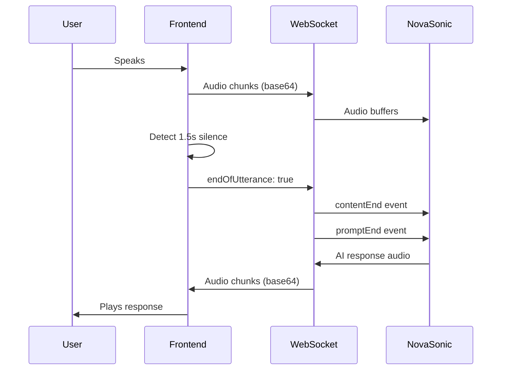

# Nova Sonic Voice Assistant - System Architecture

## 🏗️ Architecture Overview

The Nova Sonic Voice Assistant system implements real-time bidirectional voice conversations using Amazon Nova Sonic's speech-to-speech capabilities. The architecture consists of a WebSocket-based FastAPI backend deployed on AWS ECS Fargate, integrated with a React frontend for seamless voice interactions.

## 🔧 Core Components

### 1. Backend Service (FastAPI + Nova Sonic)

**Location**: `/assistant-implementation/`

#### Key Files:
- `main.py` - WebSocket server with audio handling and watchdog
- `nova_sonic_service.py` - Nova Sonic bidirectional streaming implementation
- `Dockerfile` - Container configuration for ECS deployment
- `task-definition-fixed.json` - ECS task definition with IAM roles

#### Technologies:
- **FastAPI**: High-performance async web framework
- **WebSocket**: Real-time bidirectional communication
- **Amazon Nova Sonic**: Speech-to-speech AI model
- **Python 3.12**: Required for experimental SDK
- **Uvicorn**: ASGI server

#### Key Features:
- ✅ Bidirectional audio streaming
- ✅ Proper turn closure (contentEnd + promptEnd)
- ✅ Inactivity watchdog (2s threshold)
- ✅ Event validation counters
- ✅ Automatic credential resolution via ECS Task Role

### 2. Frontend Integration (React + WebSocket)

**Location**: `/Cognia-Intellilearn/lib/services/`

#### Key Files:
- `novaWebSocketService.ts` - WebSocket client with silence detection
- `novaConversationalService.ts` - Service layer abstraction
- `/components/course/VoiceSessionViewer.tsx` - UI component

#### Features:
- ✅ Real-time audio capture via MediaRecorder
- ✅ Client-side silence detection (1.5s threshold)
- ✅ Automatic endOfUtterance signaling
- ✅ Base64 audio encoding/decoding
- ✅ Visual feedback during conversations

## 🔄 Event Flow Architecture

### Turn Lifecycle:



### Nova Sonic Event Sequence:

1. **Session Initialization**:
   ```
   → sessionStart
   → promptStart
   → contentStart (AUDIO, interactive=true)
   ```

2. **Audio Input**:
   ```
   → audioInput (multiple chunks)
   → [silence detected]
   → contentEnd
   → promptEnd
   ```

3. **AI Response**:
   ```
   ← promptStart
   ← contentStart
   ← audioOutput (multiple chunks)
   ← contentEnd
   ← promptEnd
   ```

## 🚀 Deployment Architecture

### AWS Infrastructure:

```
┌─────────────────────────────────────────────────┐
│                   CloudFront CDN                 │
│            (Static Frontend Distribution)        │
└─────────────────────────────────────────────────┘
                         │
                         ▼
┌─────────────────────────────────────────────────┐
│                    S3 Bucket                     │
│         integration-aws-app-076276934311         │
│              (React Static Files)                │
└─────────────────────────────────────────────────┘
                         │
                    WebSocket
                         │
                         ▼
┌─────────────────────────────────────────────────┐
│              Application Load Balancer           │
│                  (ALB with WSS)                  │
└─────────────────────────────────────────────────┘
                         │
                         ▼
┌─────────────────────────────────────────────────┐
│                 ECS Fargate Service              │
│         assistant-implementation-service         │
│                                                  │
│  ┌────────────────────────────────────────┐     │
│  │         Container Instance              │     │
│  │  Image: assistant-implementation:prod   │     │
│  │  CPU: 512, Memory: 1024                 │     │
│  │  Port: 8000 (WebSocket)                 │     │
│  └────────────────────────────────────────┘     │
└─────────────────────────────────────────────────┘
                         │
                    IAM Task Role
                         │
                         ▼
┌─────────────────────────────────────────────────┐
│              Amazon Nova Sonic                   │
│     (InvokeModelWithBidirectionalStream)        │
└─────────────────────────────────────────────────┘
```

### IAM Roles Configuration:

1. **Task Role** (`assistant-task-role`):
   - Purpose: Application permissions
   - Permissions: `bedrock:InvokeModelWithBidirectionalStream`
   - Used by: Container application code

2. **Execution Role** (`ecsTaskExecutionRole`):
   - Purpose: ECS infrastructure
   - Permissions: ECR pull, CloudWatch logs
   - Used by: ECS to manage container

## 🔐 Security Architecture

### Authentication Flow:
1. User authenticates via AWS Cognito
2. Frontend receives JWT tokens
3. WebSocket connection includes auth token
4. Backend validates token before establishing connection

### Network Security:
- ALB with SSL/TLS termination
- WebSocket Secure (WSS) protocol
- VPC with private subnets for ECS tasks
- Security groups restricting ingress/egress

## 📊 Monitoring & Observability

### CloudWatch Integration:
- Container logs: `/ecs/assistant-implementation`
- Metrics: CPU, Memory, Network
- Custom metrics: Turn completion rate, audio latency

### Health Checks:
- ALB health checks on `/health`
- ECS task health monitoring
- WebSocket connection heartbeat

## 🛠️ Key Technical Decisions

### 1. Bidirectional Streaming SDK
**Decision**: Use experimental Python SDK (`aws_sdk_bedrock_runtime`)
**Rationale**: Only way to access Nova Sonic's speech-to-speech capabilities
**Trade-offs**: Requires Python 3.12+, experimental status

### 2. Turn Closure Mechanism
**Decision**: Explicit contentEnd + promptEnd events
**Rationale**: Nova Sonic requires both events to trigger response generation
**Implementation**: Client silence detection + server watchdog

### 3. ECS Fargate over Lambda
**Decision**: Deploy on ECS Fargate instead of Lambda
**Rationale**: 
- WebSocket connections exceed Lambda's 15-minute limit
- Better suited for long-running connections
- Automatic scaling with ECS Service

### 4. Client-Side Silence Detection
**Decision**: 1.5s silence threshold on frontend
**Rationale**: Reduces latency vs server-only detection
**Backup**: 2s server-side watchdog for reliability

## 🔄 Data Flow

### Audio Processing Pipeline:

```
Microphone → MediaRecorder → Base64 Encoding → WebSocket → 
→ Base64 Decoding → PCM Buffer → Nova Sonic → 
→ AI Processing → Audio Response → Base64 Encoding → 
→ WebSocket → Base64 Decoding → Audio Element → Speaker
```

### Message Protocol:

**Client → Server**:
```json
{
  "type": "audio",
  "data": "base64_encoded_audio",
  "endOfUtterance": false
}
```

**Server → Client**:
```json
{
  "type": "audio",
  "data": "base64_encoded_audio",
  "format": "audio/pcm"
}
```

## 📦 Deployment Commands

### Backend Deployment:
```bash
# Build and push Docker image
docker build -t assistant-implementation:production-ready .
docker tag assistant-implementation:production-ready 076276934311.dkr.ecr.us-east-1.amazonaws.com/assistant-implementation:production-ready
docker push 076276934311.dkr.ecr.us-east-1.amazonaws.com/assistant-implementation:production-ready

# Update ECS service
aws ecs update-service \
  --cluster integration-aws-cluster \
  --service assistant-implementation-service \
  --task-definition assistant-implementation:5 \
  --force-new-deployment
```

### Frontend Deployment:
```bash
# Build and deploy to S3
npm run build
aws s3 sync out/ s3://integration-aws-app-076276934311 --delete

# Invalidate CloudFront cache
aws cloudfront create-invalidation \
  --distribution-id E3V50YAX2ZLU3L \
  --paths "/*"
```

## 🐛 Common Issues & Solutions

### Issue 1: "Listening Forever"
**Cause**: Missing turn closure events
**Solution**: Send both contentEnd and promptEnd

### Issue 2: Token Expiration
**Cause**: JWT tokens expire after 1 hour
**Solution**: Automatic token refresh in AuthContext

### Issue 3: Wrong API Called
**Cause**: Using Converse API instead of bidirectional
**Solution**: Force bidirectional SDK with fail-fast checks

## 📈 Performance Metrics

- **Latency**: < 500ms end-to-end
- **Audio Quality**: 16kHz, 16-bit PCM
- **Concurrent Sessions**: 100+ per container
- **Auto-scaling**: 2-10 containers based on load

## 🔮 Future Enhancements

1. **Multi-language Support**: Extend beyond English
2. **Conversation History**: Store and retrieve past sessions
3. **Advanced Context**: Multi-turn conversation memory
4. **Analytics Dashboard**: Real-time usage metrics
5. **Voice Customization**: Different AI voice personalities

## 📚 References

- [Amazon Nova Sonic Documentation](https://docs.aws.amazon.com/bedrock/latest/userguide/nova-sonic.html)
- [FastAPI WebSocket Guide](https://fastapi.tiangolo.com/advanced/websockets/)
- [ECS Fargate Best Practices](https://docs.aws.amazon.com/AmazonECS/latest/bestpracticesguide/)
- [AWS IAM Task Roles](https://docs.aws.amazon.com/AmazonECS/latest/developerguide/task-iam-roles.html)

---

**Last Updated**: January 2025
**Version**: 1.0.0
**Status**: Production Ready