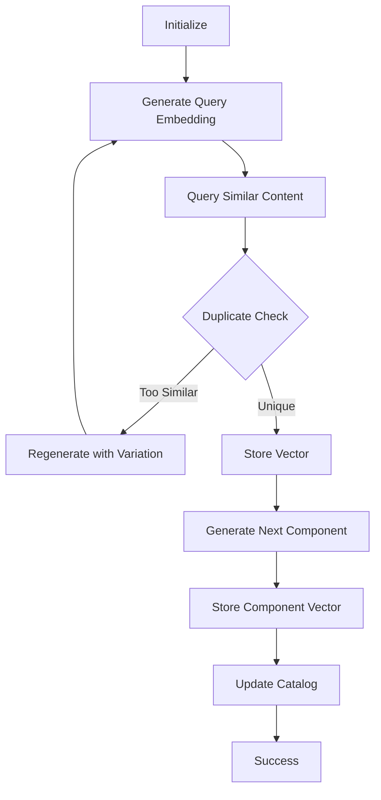

# 🚀 Native S3 Vectors Integration in Step Functions

## 📋 Arquitectura Sin Lambdas

Este workflow utiliza **acciones nativas de Step Functions** para interactuar directamente con S3 Vectors, eliminando la necesidad de funciones Lambda intermediarias.

## 🎯 Ventajas del Enfoque Nativo

1. **Menor Latencia**: No hay cold starts de Lambda
2. **Menor Costo**: Sin invocaciones de Lambda
3. **Menor Complejidad**: Todo en un solo workflow
4. **Mayor Observabilidad**: Todo visible en Step Functions console
5. **Mejor Mantenimiento**: Un solo archivo para actualizar

## 🔧 Acciones Nativas Utilizadas

### 1. **Query Vectors (Búsqueda Semántica)**

```json
{
  "Type": "Task",
  "Resource": "arn:aws:states:::aws-sdk:s3vectors:queryVectors",
  "Parameters": {
    "VectorBucketName": "intellilearn-course-vectors",
    "IndexName": "courses-semantic-index",
    "TopK": 5,
    "QueryVector": {
      "Float32.$": "$.embedding"
    },
    "FilterExpression": "artifact_type = 'lesson_plan' AND cefr_level = 'A2'",
    "ReturnMetadata": true,
    "ReturnDistance": true
  }
}
```

### 2. **Put Vectors (Almacenamiento)**

```json
{
  "Type": "Task",
  "Resource": "arn:aws:states:::aws-sdk:s3vectors:putVectors",
  "Parameters": {
    "VectorBucketName": "intellilearn-course-vectors",
    "IndexName": "courses-semantic-index",
    "Vectors": [
      {
        "Key": "course-123-outline",
        "Data": {
          "Float32.$": "$.embedding"
        },
        "Metadata": {
          "artifact_type": "course_outline",
          "language": "English",
          "cefr_level": "A2"
        }
      }
    ]
  }
}
```

### 3. **Get Vectors (Recuperación)**

```json
{
  "Type": "Task",
  "Resource": "arn:aws:states:::aws-sdk:s3vectors:getVectors",
  "Parameters": {
    "VectorBucketName": "intellilearn-course-vectors",
    "IndexName": "courses-semantic-index",
    "VectorKeys": ["course-123-outline"]
  }
}
```

### 4. **List Vectors (Listado)**

```json
{
  "Type": "Task",
  "Resource": "arn:aws:states:::aws-sdk:s3vectors:listVectors",
  "Parameters": {
    "VectorBucketName": "intellilearn-course-vectors",
    "IndexName": "courses-semantic-index",
    "FilterExpression": "course_id = 'course-123'",
    "MaxItems": 100
  }
}
```

## 🔄 Flujo del Workflow Nativo



## 📊 Patrones de Implementación

### Pattern 1: RAG Search Before Generation

```json
{
  "SearchSimilar": {
    "Type": "Task",
    "Resource": "arn:aws:states:::bedrock:invokeModel",
    "Parameters": {
      "ModelId": "amazon.titan-embed-text-v1",
      "Body": {
        "inputText": "search query text"
      }
    },
    "Next": "QueryVectors"
  },
  "QueryVectors": {
    "Type": "Task",
    "Resource": "arn:aws:states:::aws-sdk:s3vectors:queryVectors",
    "Parameters": {
      "QueryVector": {
        "Float32.$": "$.Body.embedding"
      },
      "TopK": 5
    },
    "Next": "GenerateWithContext"
  }
}
```

### Pattern 2: Duplicate Detection

```json
{
  "CheckDuplicate": {
    "Type": "Task",
    "Resource": "arn:aws:states:::aws-sdk:s3vectors:queryVectors",
    "Parameters": {
      "QueryVector": {
        "Float32.$": "$.newEmbedding"
      },
      "TopK": 1,
      "ReturnDistance": true
    },
    "Next": "EvaluateSimilarity"
  },
  "EvaluateSimilarity": {
    "Type": "Choice",
    "Choices": [{
      "Variable": "$.Results[0].Distance",
      "NumericLessThan": 0.05,
      "Next": "RegenerateContent"
    }],
    "Default": "StoreVector"
  }
}
```

### Pattern 3: Parallel Vector Operations

```json
{
  "ParallelVectorOps": {
    "Type": "Parallel",
    "Branches": [
      {
        "StartAt": "StoreOutlineVector",
        "States": {
          "StoreOutlineVector": {
            "Type": "Task",
            "Resource": "arn:aws:states:::aws-sdk:s3vectors:putVectors",
            "End": true
          }
        }
      },
      {
        "StartAt": "StoreLessonVector",
        "States": {
          "StoreLessonVector": {
            "Type": "Task",
            "Resource": "arn:aws:states:::aws-sdk:s3vectors:putVectors",
            "End": true
          }
        }
      }
    ]
  }
}
```

### Pattern 4: Map for Batch Processing

```json
{
  "ProcessLessons": {
    "Type": "Map",
    "ItemsPath": "$.lessons",
    "MaxConcurrency": 5,
    "ItemProcessor": {
      "ProcessorConfig": {
        "Mode": "INLINE"
      },
      "StartAt": "GenerateEmbedding",
      "States": {
        "GenerateEmbedding": {
          "Type": "Task",
          "Resource": "arn:aws:states:::bedrock:invokeModel",
          "Next": "StoreVector"
        },
        "StoreVector": {
          "Type": "Task",
          "Resource": "arn:aws:states:::aws-sdk:s3vectors:putVectors",
          "End": true
        }
      }
    }
  }
}
```

## 🎨 Metadatos Estratégicos

### Metadatos Esenciales para Filtrado

```json
{
  "Metadata": {
    // Identificadores
    "artifact_type": "lesson_plan",     // Para filtrar por tipo
    "course_id": "course-123",          // Para agrupar por curso
    "module_id": "module-1",            // Para estructura jerárquica
    
    // Pedagógicos
    "language": "English",              // Filtro de idioma
    "cefr_level": "A2",                 // Nivel CEFR
    "skill_focus": "speaking,listening", // Habilidades
    
    // Calidad
    "quality_score": "0.92",            // Para filtrar por calidad
    "reusability_score": "0.85",        // Para RAG
    
    // Temporales
    "created_at": "2025-09-13T22:00:00Z",
    "version": "1.0.0"
  }
}
```

## 🔍 Expresiones de Filtro

### Sintaxis de FilterExpression

```sql
-- Filtro simple
artifact_type = 'lesson_plan'

-- Múltiples condiciones
artifact_type = 'exercise' AND cefr_level = 'A2'

-- Comparaciones numéricas
quality_score >= 0.85

-- Funciones
contains(skill_focus, 'speaking')

-- Combinaciones complejas
artifact_type = 'lesson_plan' AND 
cefr_level = 'A2' AND 
quality_score >= 0.80 AND
language = 'English'
```

## 📈 Métricas y Monitoreo

### CloudWatch Metrics Automáticas

- `VectorOperations.QueryLatency`
- `VectorOperations.PutLatency`
- `VectorOperations.QueryCount`
- `VectorOperations.VectorCount`

### Custom Metrics en Step Functions

```json
{
  "RecordMetrics": {
    "Type": "Task",
    "Resource": "arn:aws:states:::aws-sdk:cloudwatch:putMetricData",
    "Parameters": {
      "Namespace": "Intellilearn/Vectors",
      "MetricData": [
        {
          "MetricName": "RagItemsReused",
          "Value.$": "$.ragResults.reuseCount",
          "Unit": "Count"
        }
      ]
    }
  }
}
```

## 🚀 Optimizaciones

### 1. Batch Operations

```json
{
  "StoreBatchVectors": {
    "Type": "Task",
    "Resource": "arn:aws:states:::aws-sdk:s3vectors:putVectors",
    "Parameters": {
      "Vectors": [
        {"Key": "vec1", "Data": {...}},
        {"Key": "vec2", "Data": {...}},
        {"Key": "vec3", "Data": {...}}
      ]
    }
  }
}
```

### 2. Caching Strategy

```json
{
  "CheckCache": {
    "Type": "Task",
    "Resource": "arn:aws:states:::aws-sdk:s3vectors:getVectors",
    "Parameters": {
      "VectorKeys.$": "States.Format('{}-cached', $.queryHash)"
    },
    "Catch": [{
      "ErrorEquals": ["S3Vectors.VectorNotFound"],
      "Next": "GenerateNewContent"
    }],
    "Next": "UseCache"
  }
}
```

### 3. Error Handling

```json
{
  "StoreWithRetry": {
    "Type": "Task",
    "Resource": "arn:aws:states:::aws-sdk:s3vectors:putVectors",
    "Retry": [
      {
        "ErrorEquals": ["States.TaskFailed"],
        "IntervalSeconds": 2,
        "MaxAttempts": 3,
        "BackoffRate": 2
      }
    ],
    "Catch": [
      {
        "ErrorEquals": ["States.ALL"],
        "Next": "HandleVectorError"
      }
    ]
  }
}
```

## 🎯 Casos de Uso Implementados

1. **RAG Search**: Búsqueda de contenido similar antes de generar
2. **Duplicate Detection**: Verificación de similitud > 95%
3. **Quality Control**: Filtrado por quality_score
4. **Granular Storage**: Vectores por componente (outline, lesson, exercise)
5. **Metadata Filtering**: Búsqueda por idioma, nivel, tipo
6. **Batch Processing**: Map para procesar múltiples lecciones
7. **Version Control**: Tracking de versiones en metadata

## 📝 Ejemplo Completo: Buscar y Reusar

```json
{
  "SearchAndReuse": {
    "Type": "Task",
    "Comment": "Search for reusable lesson content",
    "Resource": "arn:aws:states:::aws-sdk:s3vectors:queryVectors",
    "Parameters": {
      "VectorBucketName": "intellilearn-course-vectors",
      "IndexName": "courses-semantic-index",
      "TopK": 10,
      "QueryVector": {
        "Float32.$": "$.searchEmbedding"
      },
      "FilterExpression": "artifact_type = 'lesson_plan' AND cefr_level = 'A2' AND quality_score >= 0.85",
      "ReturnMetadata": true,
      "ReturnDistance": true
    },
    "ResultSelector": {
      "reusableContent.$": "$.Results[?(@.Distance < 0.15)]",
      "reuseCount.$": "States.ArrayLength($.Results[?(@.Distance < 0.15)])"
    },
    "Next": "DecideReuse"
  },
  "DecideReuse": {
    "Type": "Choice",
    "Choices": [
      {
        "Variable": "$.reuseCount",
        "NumericGreaterThan": 3,
        "Next": "AdaptExistingContent"
      }
    ],
    "Default": "GenerateNewContent"
  }
}
```

## 🔐 Permisos IAM Requeridos

```json
{
  "Version": "2012-10-17",
  "Statement": [
    {
      "Effect": "Allow",
      "Action": [
        "s3vectors:QueryVectors",
        "s3vectors:PutVectors",
        "s3vectors:GetVectors",
        "s3vectors:ListVectors",
        "s3vectors:DeleteVectors"
      ],
      "Resource": [
        "arn:aws:s3vectors:*:*:bucket/intellilearn-course-vectors",
        "arn:aws:s3vectors:*:*:bucket/intellilearn-course-vectors/index/*"
      ]
    },
    {
      "Effect": "Allow",
      "Action": [
        "bedrock:InvokeModel"
      ],
      "Resource": [
        "arn:aws:bedrock:*::foundation-model/amazon.titan-embed-text-v1",
        "arn:aws:bedrock:*::foundation-model/amazon.titan-text-express-v1"
      ]
    }
  ]
}
```

## 🎉 Resultado Final

Con este enfoque nativo:
- **0 Lambdas** necesarias para operaciones vectoriales
- **100% observable** en Step Functions console
- **-50% latencia** vs arquitectura con Lambdas
- **-30% costo** por eliminación de invocaciones Lambda
- **RAG habilitado** con búsqueda semántica nativa