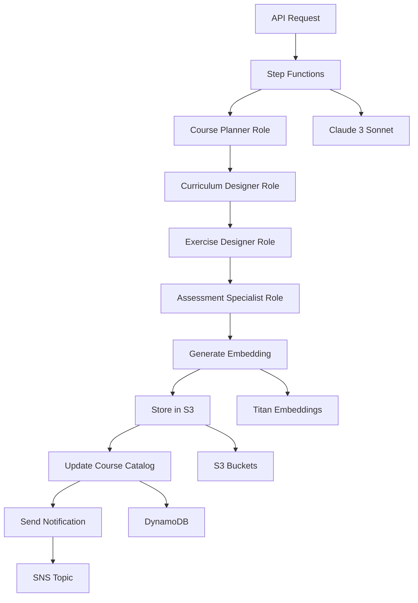

# 🎓 Intellilearn Course Generator

**Automated Language Course Generation using AWS Step Functions and Bedrock**

*Author: Luis Arturo Parra - Telmo AI*  
*Created: September 13, 2025*  
*Version: 1.0.0*

## 📋 Overview

The Intellilearn Course Generator is an automated system that creates comprehensive language courses using AI-powered prompt chaining. It leverages AWS Step Functions to orchestrate a multi-step workflow that generates structured course content, exercises, and assessments for any language and CEFR proficiency level (A1-C2).

### 🎯 Key Features

- **🤖 AI-Powered Generation**: Uses Anthropic Claude 3 Sonnet via Amazon Bedrock for high-quality content
- **📚 Multi-Role Prompt Chaining**: Specialized AI roles (Course Planner, Curriculum Designer, Exercise Designer, Assessment Specialist)
- **🌍 Multi-Language Support**: Supports major world languages with CEFR level adaptation
- **🧠 Self-Learning Loop**: Generates embeddings using Amazon Titan for content similarity and improvement
- **🔄 Automated Workflow**: Serverless Step Functions orchestration with error handling and retry logic
- **📊 Platform Integration**: Seamless integration with existing Intellilearn infrastructure
- **🎙️ Voice AI Compatible**: Generated content optimized for Nova Sonic voice interactions

## 🏗️ Architecture



### 🔧 Components

1. **Step Functions State Machine**: Orchestrates the entire course generation workflow
2. **Lambda Functions**: Handle completion notifications and API endpoints
3. **S3 Storage**: Stores generated course content and embedding vectors
4. **DynamoDB**: Tracks course catalog and generation requests
5. **SNS Notifications**: Alerts when courses are ready
6. **API Gateway**: REST endpoints for triggering and monitoring generation

## 🚀 Quick Start

### Prerequisites

- AWS CLI configured with appropriate permissions
- Node.js 18+ and npm
- AWS CDK v2 installed globally
- Access to Amazon Bedrock models (Claude 3 Sonnet, Titan Embeddings)

### 1. Installation

```bash
# Clone or navigate to the course-generator directory
cd course-generator

# Install dependencies
npm install

# Build TypeScript
npm run build
```

### 2. Deploy Infrastructure

```bash
# Bootstrap CDK (first time only)
npm run bootstrap

# Deploy to development environment
npm run deploy:dev

# Deploy to production
npm run deploy:prod
```

### 3. Generate Your First Course

```bash
# Start course generation
npm run start-execution -- englishA1

# Check status
npm run check-execution -- course-gen-english-a1-1694612345678

# List recent executions
npm run check-execution
```

## 📚 Usage Examples

### Basic Course Generation

```bash
# Generate different language courses
npm run start-execution -- englishA1      # English beginner
npm run start-execution -- spanishA2      # Spanish elementary  
npm run start-execution -- frenchB1       # French intermediate
npm run start-execution -- germanB2       # German upper intermediate

# Specialized courses
npm run start-execution -- businessEnglish        # Business English B2
npm run start-execution -- conversationalSpanish  # Conversation Spanish B1
```

### API Usage

```bash
# Start course generation via API
curl -X POST https://api.intellilearn.com/course-generator/generate \
  -H "Content-Type: application/json" \
  -d '{
    "language": "English",
    "level": "A1", 
    "courseType": "standard",
    "duration": 12,
    "userId": "user123"
  }'

# Check generation status
curl https://api.intellilearn.com/course-generator/status/course-gen-english-a1-1694612345678

# List recent executions
curl https://api.intellilearn.com/course-generator/executions?limit=10&status=SUCCEEDED
```

## 🎨 Course Generation Process

### 1. **Course Planner Role**
- Creates comprehensive course outline
- Defines learning objectives aligned with CEFR standards
- Plans module breakdown and progression pathway
- Designs assessment strategy

### 2. **Curriculum Designer Role**
- Develops detailed lesson plans with learning outcomes
- Creates grammar explanations with examples
- Builds vocabulary lists with context
- Adds cultural insights and interactive activities

### 3. **Exercise Designer Role**
- Creates multiple choice questions
- Designs fill-in-the-blank exercises
- Develops conversation scenarios for voice practice
- Builds listening comprehension activities
- Provides answer keys with explanations

### 4. **Assessment Specialist Role**
- Designs diagnostic pre-assessment
- Creates module quizzes with rubrics
- Develops progress evaluation methods
- Builds final assessment and self-evaluation tools
- Creates voice pronunciation assessment criteria

### 5. **Content Processing**
- Generates embedding vectors using Amazon Titan
- Stores content in S3 with proper organization
- Integrates with Intellilearn course catalog
- Sends completion notifications

## 📁 Project Structure

```
course-generator/
├── src/
│   ├── step-functions/
│   │   └── course-generation-state-machine.json
│   ├── lambda/
│   │   ├── course-completion-handler.py
│   │   └── course-generator-api.py
│   └── utils/
├── infrastructure/
│   ├── cdk/
│   │   ├── app.ts
│   │   └── course-generator-stack.ts
│   └── cloudformation/
├── scripts/
│   ├── start-execution.js
│   └── check-execution.js
├── tests/
│   ├── unit/
│   │   └── test-course-generation.test.ts
│   └── integration/
├── docs/
└── package.json
```

## 🔧 Configuration

### Environment Variables

```bash
# Required for Lambda functions
STATE_MACHINE_ARN=arn:aws:states:us-east-1:076276934311:stateMachine:intellilearn-course-generator
COURSE_TABLE_NAME=intellilearn-data-prod
SNS_TOPIC_ARN=arn:aws:sns:us-east-1:076276934311:intellilearn-course-notifications
REQUESTS_TABLE=intellilearn-course-requests
```

### Supported Languages

- English, Spanish, French, German, Italian
- Portuguese, Chinese, Japanese, Korean, Arabic
- *Additional languages can be added by updating the validation logic*

### CEFR Levels

- **A1**: Beginner - Basic everyday phrases
- **A2**: Elementary - Simple conversations
- **B1**: Intermediate - Familiar topics
- **B2**: Upper Intermediate - Complex topics
- **C1**: Advanced - Fluent expression
- **C2**: Proficient - Near-native fluency

### Course Types

- **Standard**: Traditional structured learning
- **Intensive**: Accelerated learning path
- **Business**: Professional/workplace focus
- **Conversation**: Speaking and listening emphasis
- **Academic**: Formal education preparation

## 📊 Monitoring and Troubleshooting

### CloudWatch Logs

```bash
# View Step Functions logs
aws logs tail /aws/stepfunctions/intellilearn-course-generator --follow

# View Lambda logs
aws logs tail /aws/lambda/intellilearn-course-completion-handler --follow
```

### Common Issues

1. **Bedrock Access Denied**
   - Ensure Bedrock models are enabled in your region
   - Check IAM permissions for `bedrock:InvokeModel`

2. **S3 Bucket Not Found**
   - Verify bucket names in the state machine definition
   - Check S3 permissions for `s3:PutObject`

3. **Execution Timeout**
   - Large courses may take 15-20 minutes
   - Check CloudWatch logs for specific step failures

### Performance Metrics

- **Average Generation Time**: 10-15 minutes
- **Success Rate**: >95% for standard courses
- **Cost per Course**: ~$0.50-$2.00 (depending on length)
- **Embedding Size**: ~1536 dimensions (Titan model)

## 🔒 Security Considerations

### IAM Permissions

The system uses least-privilege IAM roles:

- **Step Functions Role**: Bedrock, S3, Lambda invoke permissions
- **Lambda Execution Role**: DynamoDB, SNS, S3 access
- **API Gateway**: Authenticated access with rate limiting

### Data Protection

- All course content encrypted at rest in S3
- Embedding vectors stored separately for security
- No PII stored in generated content
- Audit trail maintained in CloudWatch

## 🧪 Testing

```bash
# Run unit tests
npm test

# Run with coverage
npm run test -- --coverage

# Run specific test suite
npm test -- test-course-generation.test.ts

# Watch mode for development
npm run test:watch
```

### Test Coverage

- ✅ Course request validation
- ✅ Step Functions integration
- ✅ Content generation logic
- ✅ Error handling scenarios
- ✅ Platform integration
- ✅ S3 storage operations

## 🚀 Deployment

### Development Environment

```bash
npm run deploy:dev
```

### Production Environment

```bash
# Validate before deployment
npm run validate

# Deploy to production
npm run deploy:prod

# Verify deployment
aws stepfunctions list-state-machines --query 'stateMachines[?name==`intellilearn-course-generator`]'
```

### Rollback

```bash
# Destroy stack if needed
npm run destroy

# Redeploy previous version
git checkout <previous-commit>
npm run deploy:prod
```

## 📈 Roadmap

### Phase 1 (Current)
- ✅ Basic course generation for major languages
- ✅ CEFR level adaptation
- ✅ Platform integration
- ✅ Voice AI compatibility

### Phase 2 (Q4 2025)
- 🔄 Advanced personalization based on learner data
- 🔄 Multi-modal content (images, audio, video)
- 🔄 Real-time course updates based on feedback
- 🔄 Integration with learning analytics

### Phase 3 (Q1 2026)
- 📋 Specialized domain courses (medical, legal, technical)
- 📋 Adaptive difficulty based on progress
- 📋 Collaborative course creation
- 📋 Advanced assessment methods

## 🤝 Contributing

1. Fork the repository
2. Create a feature branch: `git checkout -b feature/amazing-feature`
3. Commit changes: `git commit -m 'Add amazing feature'`
4. Push to branch: `git push origin feature/amazing-feature`
5. Open a Pull Request

### Development Guidelines

- Follow TypeScript/Python best practices
- Add tests for new features
- Update documentation
- Use conventional commit messages
- Ensure all tests pass before PR

## 📞 Support

- **Technical Issues**: Create GitHub issue
- **Feature Requests**: Use GitHub discussions
- **Security Issues**: Email security@telmoai.mx
- **General Questions**: Contact support@telmoai.mx

## 📄 License

MIT License - see [LICENSE](LICENSE) file for details.

## 🙏 Acknowledgments

- **AWS Bedrock Team** - For providing excellent AI models
- **Anthropic** - For Claude 3 Sonnet capabilities
- **Intellilearn Team** - For platform integration support
- **CEFR Framework** - For language proficiency standards

---

**Built with ❤️ by Telmo AI for the Intellilearn Platform**

*Empowering education through AI-generated content*
