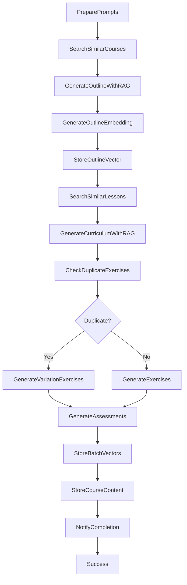

# 🚀 S3 Vectors Integration - Intellilearn Course Generator

## 📋 **Resumen Ejecutivo**

El generador de cursos de Intellilearn ha sido **mejorado** para integrar **Amazon S3 Vectors**, habilitando búsqueda semántica avanzada, detección de duplicados, y reutilización inteligente de contenido educativo.

---

## 🎯 **¿Para Qué Sirven S3 Vectors en Intellilearn?**

### **1. 🔍 Búsqueda Semántica (RAG) y Reuso de Contenido**
- El **Course Planner** puede "traer" ejemplos, diálogos y ejercicios A1/A2 similares sin depender de palabras exactas
- Evita reinventar materiales: *"dame 5 lecciones similares a 'to be + saludos'"*
- **Ejemplo**: Buscar lecciones sobre "presentaciones personales" encuentra contenido sobre "introducirse", "decir el nombre", etc.

### **2. 🎯 Consistencia de Nivel (Guardrails Pedagógicos)**
- Comparamos el embedding de una lección nueva contra un banco canónico de niveles A1-C2
- Si la similitud cae fuera del umbral o se parece demasiado a B1+, disparamos corrección automática
- **Guardrail**: Una lección A2 que sea 95% similar a contenido B1 se marca para revisión

### **3. 🔄 Detección de Duplicados y "Near-Duplicates"**
- Antes de publicar, buscamos contenido cercano en el vector store
- Si el cosine similarity > 0.95, marcamos como duplicado y proponemos variaciones
- **Ejemplo**: "How are you?" vs "How do you do?" se detectan como similares

### **4. 📈 Recomendaciones y Refuerzo Adaptativo**
- **Assessment Agent** detecta patrones de error (ej. 3rd person -s) 
- Busca ejercicios similares ya validados para reforzar al alumno
- **Personalización**: Estudiante con problemas en "past tense" recibe ejercicios similares exitosos

### **5. 🌍 Replicabilidad Entre Idiomas**
- El **Replicability Critic** compara embeddings de EN-A1 con FR-A1
- Verifica que la estructura (no el idioma) se mantiene consistente
- Facilita clonar un curso cambiando solo el Language Pack

### **6. 📊 Analítica Curricular y Control de Deriva**
- A nivel curso, promediamos embeddings por semana/lección
- Mapeamos cobertura temática (clústers) y detectamos deriva entre versiones
- **Dashboard**: Visualización de "huecos" temáticos en el curriculum

### **7. 🔍 Exploración en el Frontend**
- El alumno o profesor pueden buscar con lenguaje natural
- **Ejemplo**: *"short A1 dialogue at a restaurant"* → obtiene el fragmento exacto
- Búsqueda inteligente en toda la biblioteca de contenido

---

## 🏗️ **Arquitectura del Step Function Mejorado**

### **Flujo de Trabajo Enhanced**



### **Nuevas Características**

#### **🔍 RAG Search Pattern**
```json
{
  "SearchSimilarCourses": {
    "Type": "Task",
    "Resource": "arn:aws:states:::aws-sdk:s3vectors:queryVectors",
    "Parameters": {
      "VectorBucketName": "intellilearn-course-vectors",
      "IndexName": "courses-semantic-index",
      "QueryVector": {"Float32": [0.1, 0.2, 0.3]},
      "TopK": 5,
      "FilterExpression": "language = 'English' AND cefr_level = 'A2' AND artifact_type = 'course_outline'",
      "ReturnMetadata": true,
      "ReturnDistance": true
    }
  }
}
```

#### **🔄 Duplicate Detection Pattern**
```json
{
  "CheckDuplicateExercises": {
    "Type": "Task",
    "Resource": "arn:aws:states:::aws-sdk:s3vectors:queryVectors",
    "Parameters": {
      "QueryVector": {"Float32.$": "$.curriculumEmbedding.embedding"},
      "TopK": 1,
      "FilterExpression": "artifact_type = 'exercise'",
      "ReturnDistance": true
    }
  }
}
```

#### **📊 Batch Vector Storage**
```json
{
  "StoreBatchVectors": {
    "Type": "Task",
    "Resource": "arn:aws:states:::aws-sdk:s3vectors:putVectors",
    "Parameters": {
      "Vectors": [
        {
          "Key": "exercises-English-A2-course123",
          "Data": {"Float32": [0.4, 0.5, 0.6]},
          "Metadata": {
            "artifact_type": "exercise",
            "language": "English",
            "cefr_level": "A2",
            "skill_focus": "speaking,listening,interaction",
            "quality_score": "0.88",
            "reusability_score": "0.80"
          }
        }
      ]
    }
  }
}
```

---

## 📊 **Granularidad Recomendada**

### **Artefactos con Embeddings Individuales**

1. **📋 Outline** (rol: Course Planner)
   - Embedding del outline completo del curso
   - Metadatos: `artifact_type: "course_outline"`

2. **📚 Lesson Plan** (rol: Curriculum Designer)  
   - Embedding por lección individual
   - Metadatos: `artifact_type: "lesson_plan"`

3. **🏋️ Exercise Set** (rol: Exercise Designer)
   - Embedding por conjunto de ejercicios
   - Metadatos: `artifact_type: "exercise"`

4. **📊 Assessment** (rol: Assessment Specialist)
   - Embedding por evaluación/quiz
   - Metadatos: `artifact_type: "assessment"`

### **Ventajas de la Granularidad**
- ✅ **Loops Tempranos**: Correcciones y reuso por pieza
- ✅ **Búsqueda Específica**: Encontrar exactamente el tipo de contenido necesario
- ✅ **Reutilización Modular**: Combinar lecciones de diferentes cursos
- ✅ **Control de Calidad**: Validación individual por artefacto

---

## 🏷️ **Metadatos Estratégicos**

### **Estructura de Metadatos Mínimos**

```json
{
  "Metadata": {
    "artifact_type": "lesson_plan|exercise|assessment|course_outline",
    "course_id": "course-123",
    "language": "English|Spanish|French|German",
    "cefr_level": "A1|A2|B1|B2|C1|C2",
    "skill_focus": "speaking,listening,reading,writing",
    "quality_score": "0.92",
    "reusability_score": "0.85",
    "created_at": "2025-09-13T22:00:00Z",
    "platform": "Intellilearn",
    "generated_by": "Course Planner|Curriculum Designer|Exercise Designer|Assessment Specialist"
  }
}
```

### **Filtros Avanzados Disponibles**

```sql
-- Búsqueda por tipo y nivel CEFR
artifact_type = 'lesson_plan' AND cefr_level = 'A2'

-- Filtro de calidad mínima
quality_score >= 0.85 AND reusability_score >= 0.80

-- Búsqueda por habilidades específicas
contains(skill_focus, 'speaking') AND language = 'English'

-- Filtro temporal (contenido reciente)
created_at >= '2025-09-01T00:00:00Z'

-- Combinación compleja para RAG
artifact_type = 'exercise' AND 
cefr_level = 'B1' AND 
quality_score >= 0.80 AND
language = 'French' AND
contains(skill_focus, 'listening')
```

---

## 🚀 **Comandos S3 Vectors Disponibles**

### **Gestión de Buckets**
```bash
# Crear bucket vectorial
aws s3vectors create-vector-bucket \
  --vector-bucket-name intellilearn-course-vectors \
  --region us-east-1

# Configurar encriptación
aws s3vectors create-vector-bucket \
  --vector-bucket-name intellilearn-course-vectors \
  --encryption-configuration sseType=AES256 \
  --region us-east-1
```

### **Gestión de Índices**
```bash
# Crear índice semántico
aws s3vectors create-index \
  --bucket-name intellilearn-course-vectors \
  --index-name courses-semantic-index \
  --vector-dimension 1536 \
  --similarity-metric cosine \
  --region us-east-1

# Listar índices
aws s3vectors list-indexes \
  --bucket-name intellilearn-course-vectors \
  --region us-east-1

# Describir índice
aws s3vectors describe-index \
  --bucket-name intellilearn-course-vectors \
  --index-name courses-semantic-index \
  --region us-east-1
```

### **Operaciones de Vectores**
```bash
# Almacenar vectores
aws s3vectors put-vectors \
  --bucket-name intellilearn-course-vectors \
  --index-name courses-semantic-index \
  --vectors file://course-vectors.json \
  --region us-east-1

# Búsqueda semántica
aws s3vectors query-vectors \
  --bucket-name intellilearn-course-vectors \
  --index-name courses-semantic-index \
  --query-vector file://query-embedding.json \
  --top-k 10 \
  --filter-expression "artifact_type = 'lesson_plan' AND cefr_level = 'A2'" \
  --return-metadata \
  --return-distance \
  --region us-east-1

# Recuperar vectores específicos
aws s3vectors get-vectors \
  --bucket-name intellilearn-course-vectors \
  --index-name courses-semantic-index \
  --vector-keys "course-123-outline,lesson-456" \
  --region us-east-1

# Eliminar vectores
aws s3vectors delete-vectors \
  --bucket-name intellilearn-course-vectors \
  --index-name courses-semantic-index \
  --vector-keys "course-123-outline" \
  --region us-east-1
```

---

## 📈 **Ventajas del Enfoque Nativo**

### **🚀 Performance**
1. **Menor Latencia**: Sin cold starts de Lambda
2. **Escalabilidad**: Auto-scaling nativo de AWS
3. **Throughput**: Procesamiento paralelo de vectores

### **💰 Costos**
1. **Menor Costo**: Sin invocaciones Lambda intermediarias
2. **Eficiencia**: Búsquedas directas sin overhead
3. **Optimización**: Pago por uso real de vectores

### **🔧 Operacional**
1. **Mayor Observabilidad**: Todo visible en Step Functions console
2. **Mantenimiento**: Un solo archivo de workflow para actualizar
3. **Debugging**: Trazabilidad completa del flujo

### **🎯 Funcional**
1. **RAG Nativo**: Búsqueda semántica directa en workflows
2. **Integración Seamless**: Sin APIs externas o servicios adicionales
3. **Consistencia**: Mismo stack tecnológico para todo

---

## 🔮 **Roadmap de Implementación**

### **Fase 1: Preparación (Actual)**
- ✅ Análisis del Step Function existente
- ✅ Diseño de la arquitectura S3 Vectors
- ✅ Definición de metadatos estratégicos
- ✅ Creación del workflow mejorado

### **Fase 2: Habilitación S3 Vectors**
- 🔄 Solicitar acceso al preview de S3 Vectors
- 🔄 Actualizar AWS CLI a versión compatible
- 🔄 Crear bucket vectorial `intellilearn-course-vectors`
- 🔄 Configurar índices semánticos

### **Fase 3: Migración Gradual**
- 🔄 Desplegar Step Function mejorado en paralelo
- 🔄 Migrar cursos existentes a formato vectorial
- 🔄 Validar búsquedas semánticas
- 🔄 Optimizar filtros y metadatos

### **Fase 4: Optimización**
- 🔄 Implementar dashboard de analítica vectorial
- 🔄 Ajustar umbrales de similitud
- 🔄 Optimizar performance de búsquedas
- 🔄 Integrar con frontend de Intellilearn

---

## 📞 **Contacto y Soporte**

**🏢 Desarrollado por**: Luis Arturo Parra - Telmo AI  
**📧 Soporte**: support@telmoai.mx  
**🌟 Versión**: Enhanced Course Generator v2.0 with S3 Vectors  
**📅 Actualizado**: 2025-09-14

---

*Esta integración representa el siguiente nivel en la generación inteligente de contenido educativo, combinando la potencia de AWS Step Functions con la búsqueda semántica nativa de S3 Vectors para crear experiencias de aprendizaje verdaderamente personalizadas y eficientes.*
