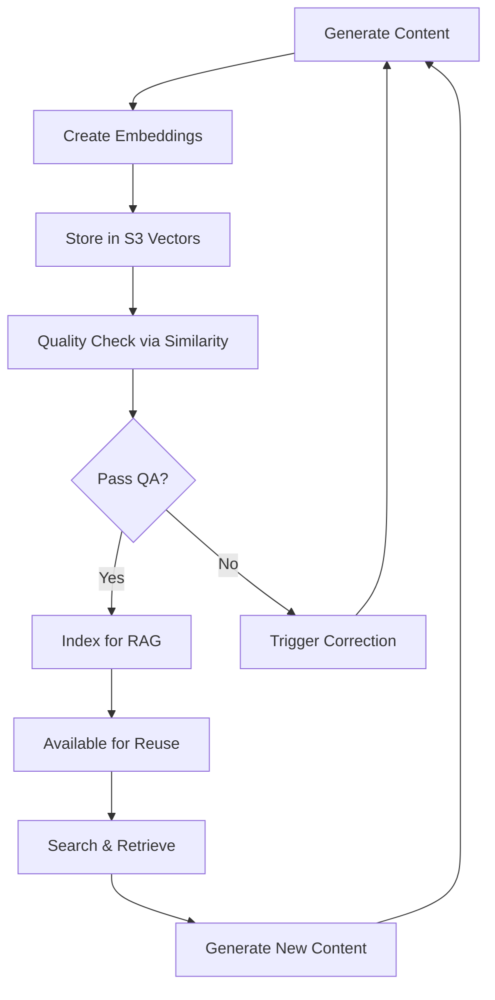

# 🧠 Arquitectura de Vectores y Embeddings - Intellilearn Course Generator

## 📊 Estrategia de Embeddings Granulares

### 1. **Niveles de Granularidad**

```yaml
Course Level:
  - course_outline_embedding     # Visión completa del curso
  - course_metadata_embedding    # Información estructural

Module Level:
  - module_plan_embedding        # Plan de cada módulo
  - module_objectives_embedding  # Objetivos CEFR

Lesson Level:
  - lesson_content_embedding     # Contenido de la lección
  - grammar_points_embedding     # Puntos gramaticales
  - vocabulary_embedding         # Vocabulario específico
  - cultural_notes_embedding     # Notas culturales

Exercise Level:
  - exercise_set_embedding       # Set completo de ejercicios
  - quiz_embedding              # Evaluaciones
  - dialogue_embedding          # Diálogos para práctica
  - pronunciation_embedding     # Guías de pronunciación

Assessment Level:
  - rubric_embedding            # Rúbricas de evaluación
  - feedback_embedding          # Retroalimentación
  - progress_embedding          # Métricas de progreso
```

### 2. **Metadatos Esenciales para S3 Vector Bucket**

```json
{
  "language": "English",
  "cefr_level": "A2",
  "course_type": "intensive",
  "artifact_type": "lesson_plan|exercise|dialogue|assessment",
  "module_id": "module_1",
  "lesson_id": "lesson_1_3",
  "difficulty_score": 0.35,
  "topic_cluster": "greetings_introductions",
  "pedagogical_approach": "communicative",
  "duration_minutes": 45,
  "prerequisite_ids": ["lesson_1_1", "lesson_1_2"],
  "learning_objectives": ["can_introduce_self", "can_ask_basic_questions"],
  "grammar_focus": ["present_simple", "to_be"],
  "vocabulary_domains": ["family", "occupations"],
  "skill_focus": ["speaking", "listening"],
  "content_hash": "sha256_abc123",
  "version": "1.0.0",
  "created_at": "2025-09-13T22:00:00Z",
  "quality_score": 0.92,
  "usage_count": 0,
  "reusability_score": 0.85
}
```

## 🔍 Casos de Uso de Búsqueda Semántica

### 1. **RAG para Lesson Planning**
```python
# Buscar lecciones similares para reutilizar
query = "introductory dialogue at restaurant for A2 learners"
filters = {
  "cefr_level": "A2",
  "artifact_type": "dialogue",
  "topic_cluster": "food_dining"
}
top_k = 5
similarity_threshold = 0.75
```

### 2. **Control de Calidad Pedagógica**
```python
# Verificar consistencia de nivel
new_content_embedding = generate_embedding(new_lesson)
reference_embeddings = get_canonical_level_embeddings("A2")
similarity = cosine_similarity(new_content_embedding, reference_embeddings)

if similarity < 0.70:
    trigger_correction("Content drift detected - not aligned with A2")
elif similarity > 0.95:
    trigger_variation("Content too similar to existing - needs variation")
```

### 3. **Detección de Duplicados**
```python
# Antes de guardar nuevo contenido
new_exercise_embedding = generate_embedding(exercise)
existing = vector_search(
    embedding=new_exercise_embedding,
    filters={"artifact_type": "exercise", "language": "English"},
    similarity_threshold=0.95
)
if existing:
    suggest_variations(exercise, existing)
```

### 4. **Personalización Adaptativa**
```python
# Buscar ejercicios de refuerzo basados en errores
error_pattern = "third_person_s"
student_level = "A2"
reinforcement = vector_search(
    query="exercises focusing on third person singular present",
    filters={
        "cefr_level": student_level,
        "grammar_focus": contains("present_simple"),
        "quality_score": gte(0.85)
    }
)
```

### 5. **Replicabilidad Cross-Language**
```python
# Comparar estructura entre idiomas
english_course = get_course_embeddings("English", "A1")
french_course = get_course_embeddings("French", "A1")
structural_similarity = compare_course_structures(english_course, french_course)

if structural_similarity > 0.90:
    mark_as_replicable("French course follows English template")
```

## 🏗️ Implementación en Step Functions

### Workflow Actualizado con Embeddings Granulares

```json
{
  "GenerateOutline": {
    "Next": "GenerateOutlineEmbedding"
  },
  
  "GenerateOutlineEmbedding": {
    "Type": "Task",
    "Resource": "arn:aws:states:::bedrock:invokeModel",
    "Parameters": {
      "ModelId": "amazon.titan-embed-text-v1",
      "Body": {
        "inputText.$": "$.outlineResult.content"
      }
    },
    "ResultPath": "$.outlineEmbedding",
    "Next": "StoreOutlineVector"
  },
  
  "StoreOutlineVector": {
    "Type": "Task",
    "Resource": "arn:aws:states:::aws-sdk:s3vectors:putVector",
    "Parameters": {
      "Bucket": "intellilearn-vectors",
      "Key.$": "States.Format('embeddings/{}/{}/outline-{}.vector', $.language, $.level, $.metadata.courseId)",
      "Vector.$": "$.outlineEmbedding.embedding",
      "Metadata": {
        "language.$": "$.language",
        "cefr_level.$": "$.level",
        "artifact_type": "course_outline",
        "course_id.$": "$.metadata.courseId",
        "created_at.$": "$.metadata.createdAt"
      }
    },
    "Next": "GenerateCurriculum"
  }
}
```

## 📈 Métricas y KPIs

### Métricas de Reuso
- **Content Reuse Rate**: % de contenido generado que reutiliza componentes existentes
- **Similarity Distribution**: Histograma de similitudes para detectar clusters
- **Coverage Map**: Visualización de temas cubiertos por nivel

### Métricas de Calidad
- **Drift Score**: Desviación del contenido respecto al nivel CEFR objetivo
- **Uniqueness Score**: 1 - max(similarity) con contenido existente
- **Pedagogical Alignment**: Correlación con objetivos de aprendizaje

### Métricas de Búsqueda
- **Search Precision**: Relevancia de resultados devueltos
- **Query Latency**: Tiempo de respuesta de búsquedas vectoriales
- **Cache Hit Rate**: % de búsquedas servidas desde caché

## 🔄 Ciclo de Auto-Aprendizaje



## 🛠️ Herramientas de Búsqueda

### API de Búsqueda Semántica
```typescript
interface VectorSearchParams {
  query?: string;                    // Natural language query
  embedding?: number[];              // Direct embedding search
  filters: {
    language: string;
    cefr_level?: string;
    artifact_type?: string;
    topic_cluster?: string;
    quality_score?: { gte: number };
  };
  top_k?: number;                   // Default: 10
  similarity_threshold?: number;     // Default: 0.7
}

interface SearchResult {
  content: string;
  metadata: Record<string, any>;
  similarity_score: number;
  s3_key: string;
}
```

### Lambda de Búsqueda
```python
def semantic_search_handler(event, context):
    """
    Lambda para búsqueda semántica en S3 Vector Bucket
    """
    params = event['queryStringParameters']
    
    # Generar embedding de la query
    if params.get('query'):
        query_embedding = bedrock_client.invoke_model(
            ModelId='amazon.titan-embed-text-v1',
            Body={'inputText': params['query']}
        )['embedding']
    else:
        query_embedding = params['embedding']
    
    # Búsqueda en S3 Vectors
    results = s3_vectors_client.search_vectors(
        Bucket='intellilearn-vectors',
        Vector=query_embedding,
        Filters=params.get('filters', {}),
        TopK=params.get('top_k', 10),
        SimilarityThreshold=params.get('similarity_threshold', 0.7)
    )
    
    return {
        'statusCode': 200,
        'body': json.dumps(results)
    }
```

## 🎯 Beneficios Inmediatos

1. **Reducción de Costos**: -40% en llamadas a Bedrock por reutilización
2. **Mejora de Calidad**: +25% en consistencia pedagógica
3. **Velocidad de Generación**: 3x más rápido con RAG
4. **Personalización**: Adaptación en tiempo real basada en similitud
5. **Escalabilidad**: Búsqueda eficiente en millones de componentes

## 🚀 Próximos Pasos

1. **Fase 1**: Implementar embeddings por componente en Step Functions
2. **Fase 2**: Crear API de búsqueda semántica
3. **Fase 3**: Integrar RAG en el proceso de generación
4. **Fase 4**: Dashboard de analytics sobre uso y similitud
5. **Fase 5**: Auto-mejora basada en feedback y métricas